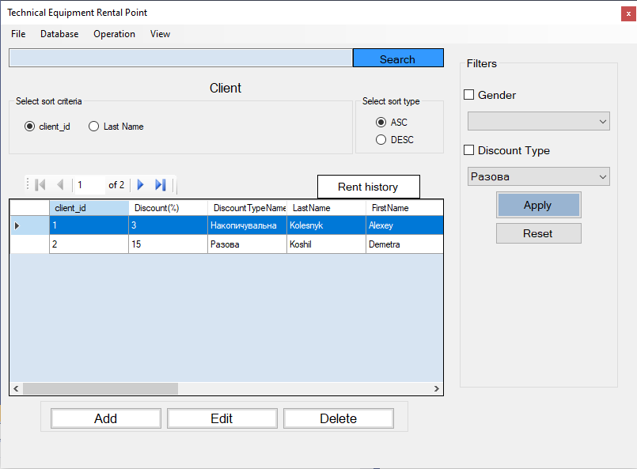
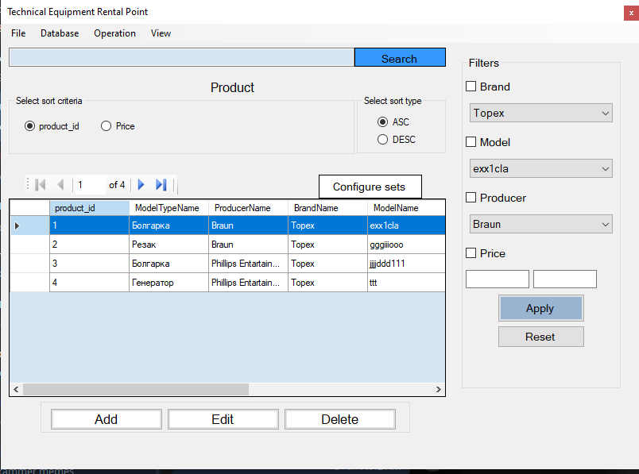
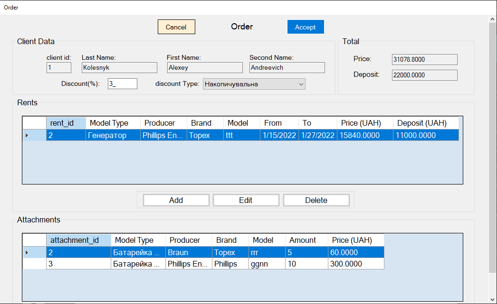
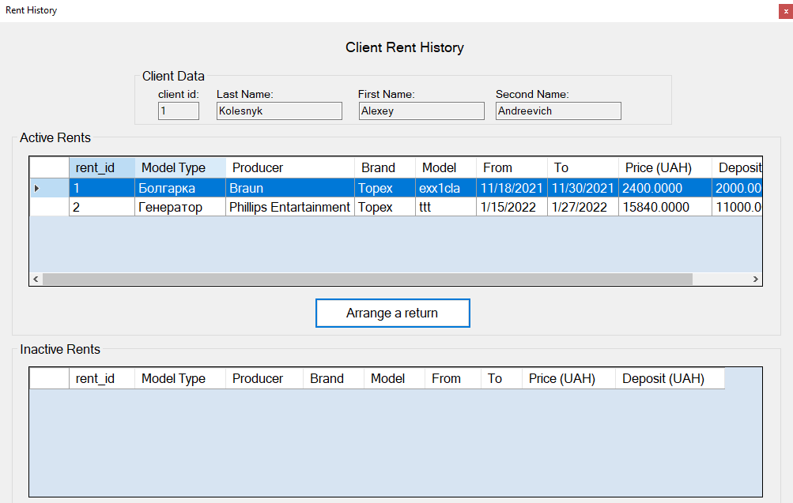
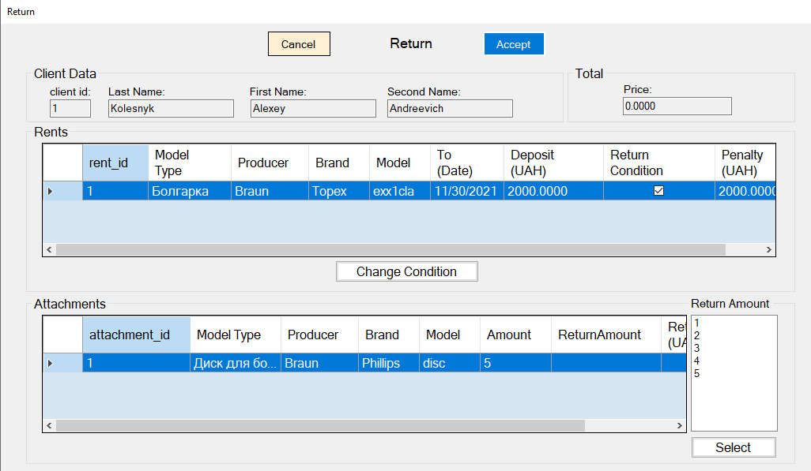

# RentalPoint
This is a desktop app for administrating an equipment rental point system wich works with SQL Server. 
In it you can edit all database tables and also place orders and returns for clients.

## Some screenshots
1. Clients table

2. Products table

3. Placing an order

4. Client rent history

5. Placing a return

